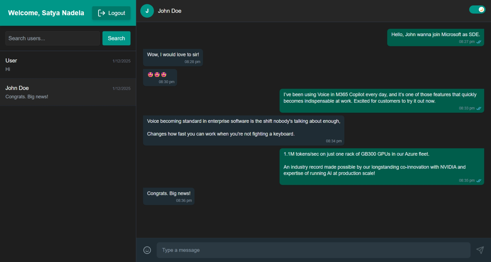
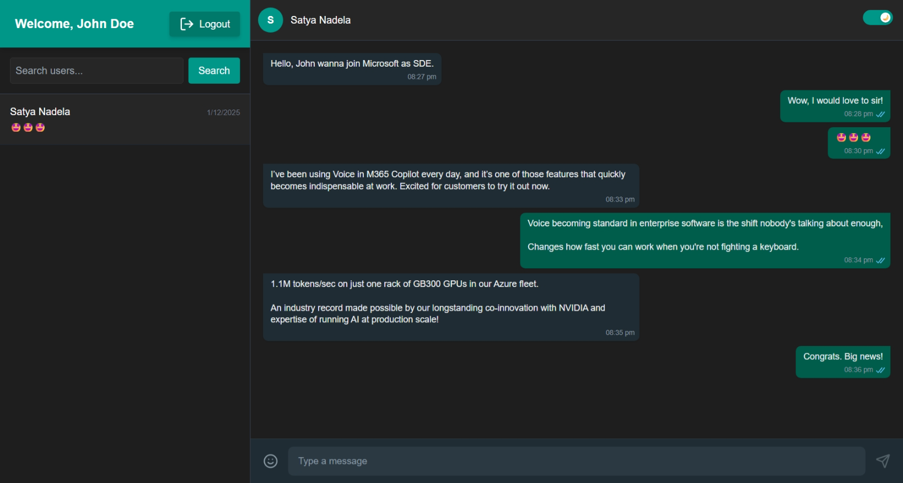
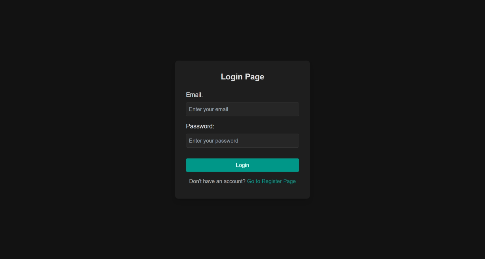
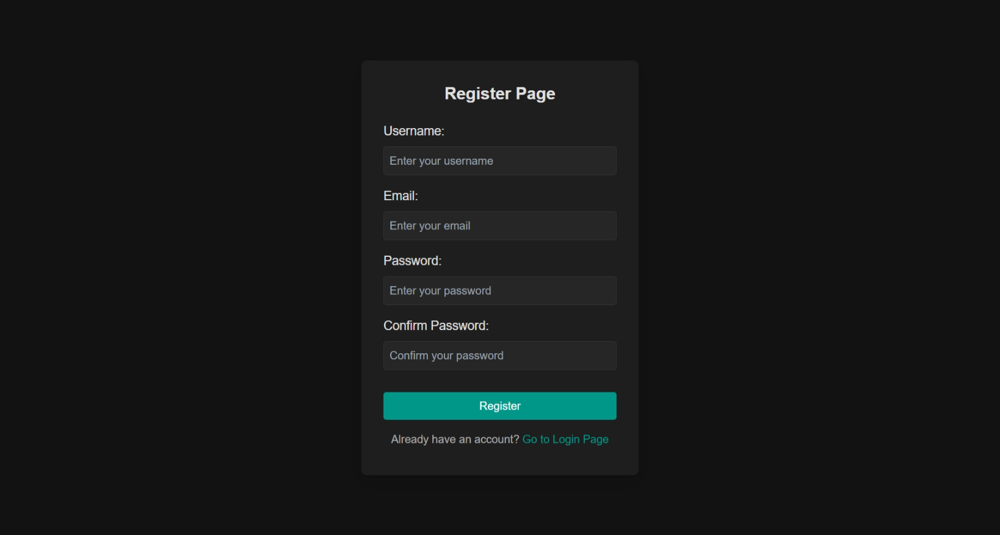

<div align="center">

# 💬 RealTime Chat

### A WhatsApp-inspired messaging app built with React & Appwrite

<p>
  
  
  
  
</p>

<p>
  <a href="#-quick-start">Quick Start</a> •
  <a href="#-features">Features</a> •
  <a href="#%EF%B8%8F-screenshots">Screenshots</a> •
  <a href="#%EF%B8%8F-tech-stack">Tech Stack</a> •
  <a href="#-contributing">Contributing</a>
</p>

<br />

<!-- Hero Screenshot -->


<br />
<br />

*Experience seamless real-time messaging with a familiar WhatsApp-like interface, powered by Appwrite's blazing-fast realtime subscriptions.*

</div>

---

## 📑 Table of Contents

- [🖼️ Screenshots](#%EF%B8%8F-screenshots)
- [✨ Features](#-features)
- [🛠️ Tech Stack](#%EF%B8%8F-tech-stack)
- [🏗️ Architecture](#%EF%B8%8F-architecture)
- [🚀 Quick Start](#-quick-start)
- [⚙️ Environment Variables](#%EF%B8%8F-environment-variables)
- [☁️ Appwrite Setup](#%EF%B8%8F-appwrite-setup)
- [📜 Available Scripts](#-available-scripts)
- [📁 Project Structure](#-project-structure)
- [🌐 Deployment](#-deployment)
- [🗺️ Roadmap](#%EF%B8%8F-roadmap)
- [🤝 Contributing](#-contributing)
- [📄 License](#-license)

---

## 🖼️ Screenshots

<div align="center">

### 💬 Chat Interface
*Real-time messaging with WhatsApp-style bubbles, timestamps, and read receipts*



<br />
<br />

### 🔐 Authentication

<table>
  <tr>
    <td align="center" width="50%">
      
      <br />
      <strong>🔑 Login Page</strong>
      <br />
      <em>Clean, minimal login interface</em>
    </td>
    <td align="center" width="50%">
      
      <br />
      <strong>📝 Register Page</strong>
      <br />
      <em>Quick sign-up with validation</em>
    </td>
  </tr>
</table>

</div>

---

## ✨ Features

<table>
  <tr>
    <td align="center" width="80px">🔐</td>
    <td><strong>Secure Authentication</strong></td>
    <td>Email/password auth via Appwrite with protected routes</td>
  </tr>
  <tr>
    <td align="center">💬</td>
    <td><strong>Real-time Messaging</strong></td>
    <td>Instant message delivery using Appwrite Realtime subscriptions</td>
  </tr>
  <tr>
    <td align="center">🌗</td>
    <td><strong>Dark/Light Mode</strong></td>
    <td>Toggle between themes with persistent preference</td>
  </tr>
  <tr>
    <td align="center">😄</td>
    <td><strong>Emoji Support</strong></td>
    <td>Full emoji picker for expressive conversations</td>
  </tr>
  <tr>
    <td align="center">🔍</td>
    <td><strong>User Search</strong></td>
    <td>Find and start conversations with any registered user</td>
  </tr>
  <tr>
    <td align="center">🗑️</td>
    <td><strong>Message Management</strong></td>
    <td>Delete your own messages with permission-based controls</td>
  </tr>
  <tr>
    <td align="center">📱</td>
    <td><strong>Responsive Design</strong></td>
    <td>Seamless experience across desktop, tablet, and mobile</td>
  </tr>
  <tr>
    <td align="center">⚡</td>
    <td><strong>Lightning Fast</strong></td>
    <td>Built with Vite for instant HMR and optimized builds</td>
  </tr>
</table>

---

## 🛠️ Tech Stack

<div align="center">

| Category | Technologies |
|:--------:|:-------------|
| **Frontend** |    |
| **Build Tool** |  |
| **Backend** |  |
| **UI Libraries** |  `emoji-picker-react` |
| **Tooling** |   |

</div>

---

## 🏗️ Architecture

```
┌─────────────────────────────────────────────────────────────────────┐
│                           FRONTEND (React)                          │
├─────────────────────────────────────────────────────────────────────┤
│  AuthContext  │  PrivateRoutes  │  React Router  │  Tailwind CSS    │
└───────────────────────────────┬─────────────────────────────────────┘
                                │
                                ▼
┌─────────────────────────────────────────────────────────────────────┐
│                        APPWRITE CLOUD                               │
├─────────────────┬─────────────────┬─────────────────┬───────────────┤
│   🔐 Accounts   │   🗄️ Databases │   📡 Realtime   │   📦 Storage │
│                 │                 │                 │               │
│  • Auth         │  • users        │  • Message      │  • Media      │
│  • Sessions     │  • conversations│    subscriptions│    uploads    │
│                 │  • messages     │                 │               │
└─────────────────┴─────────────────┴─────────────────┴───────────────┘
```

**How it works:**

1. **Authentication** → `AuthProvider` bootstraps the session via `account.get()`. Protected routes keep chat behind login.
2. **Data Layer** → Three Appwrite collections: `users`, `conversations`, and `messages`.
3. **Realtime** → The chat room subscribes to message events and patches the UI instantly.
4. **UI State** → React hooks manage search, layout breakpoints, emoji picker, and auto-scroll.

---

## 🚀 Quick Start

### Prerequisites

| Requirement | Version |
|-------------|---------|
| Node.js | 18+ |
| npm | 10+ |
| Appwrite | Cloud or Self-hosted |

### Installation

```bash
# Clone the repository
git clone https://github.com/JeetMajumdar2003/Realtime-Chat.git

# Navigate to directory
cd Realtime-Chat

# Install dependencies
npm install

# Start development server
npm run dev
```

> 🌐 Open [http://localhost:5173](http://localhost:5173) in your browser

---

## ⚙️ Environment Variables

Create a `.env` file in the root directory (use `.env.sample` as reference):

```env
VITE_APPWRITE_ENDPOINT=https://cloud.appwrite.io/v1
VITE_APPWRITE_PROJECT_ID=your_project_id
VITE_APPWRITE_DATABASE_ID=your_database_id
VITE_APPWRITE_COLLECTION_ID_MESSAGES=your_messages_collection_id
VITE_APPWRITE_COLLECTION_ID_CONVERSATIONS=your_conversations_collection_id
VITE_APPWRITE_COLLECTION_ID_USERS=your_users_collection_id
VITE_APPWRITE_BUCKET_ID=your_bucket_id
```

<details>
<summary>📋 <strong>Variable Reference</strong></summary>

| Variable | Description |
|----------|-------------|
| `VITE_APPWRITE_ENDPOINT` | Appwrite API endpoint URL |
| `VITE_APPWRITE_PROJECT_ID` | Your Appwrite project ID |
| `VITE_APPWRITE_DATABASE_ID` | Database ID for chat data |
| `VITE_APPWRITE_COLLECTION_ID_MESSAGES` | Collection storing messages |
| `VITE_APPWRITE_COLLECTION_ID_CONVERSATIONS` | Collection storing conversation metadata |
| `VITE_APPWRITE_COLLECTION_ID_USERS` | Collection storing user profiles |
| `VITE_APPWRITE_BUCKET_ID` | Storage bucket for media (optional) |

</details>

---

## ☁️ Appwrite Setup

<details>
<summary>📖 <strong>Click to expand setup instructions</strong></summary>

### 1️⃣ Create Database

Create a new database in your Appwrite console (e.g., `chat-db`).

### 2️⃣ Create Collections

#### `users` Collection
| Attribute | Type | Required |
|-----------|------|----------|
| `username` | String | ✅ |
| `email` | String | ✅ |

> ⚠️ Document ID **must** match the Appwrite Account `$id`

#### `conversations` Collection
| Attribute | Type | Required |
|-----------|------|----------|
| `participants` | String[] | ✅ |
| `last_message_body` | String | ❌ |
| `last_message_at` | DateTime | ❌ |

#### `messages` Collection
| Attribute | Type | Required |
|-----------|------|----------|
| `conversation_id` | String | ✅ |
| `user_id` | String | ✅ |
| `username` | String | ✅ |
| `body` | String | ✅ |

### 3️⃣ Create Indexes

- **conversations**: Array index on `participants`
- **messages**: Composite index on `conversation_id` + `$createdAt` (ASC)

### 4️⃣ Configure Permissions

Enable authenticated users to create/read documents. The app uses document-level permissions for message deletion.

</details>

---

## 📜 Available Scripts

| Command | Description |
|---------|-------------|
| `npm run dev` | 🚀 Start development server with HMR |
| `npm run build` | 📦 Build for production |
| `npm run preview` | 👁️ Preview production build locally |
| `npm run lint` | 🔍 Run ESLint checks |

---

## 📁 Project Structure

```
src/
├── 📄 App.jsx                 # Router + layout shell
├── 📄 appwriteConfig.js       # Appwrite client setup
├── 📄 main.jsx                # App entry point
├── 📄 index.css               # Tailwind imports
│
├── 📁 assets/                 # Static images
│   ├── chat1.png
│   ├── chat2.png
│   ├── login.png
│   └── register.png
│
├── 📁 components/
│   ├── Header.jsx             # Auth-aware navigation
│   ├── FilePreview.jsx        # File preview component
│   └── FileUploadPopup.jsx    # Upload modal
│
├── 📁 pages/
│   ├── Home.jsx               # Conversation sidebar
│   ├── Room.jsx               # Chat room with realtime
│   ├── LoginPage.jsx          # Login form
│   └── RegisterPage.jsx       # Registration form
│
└── 📁 utils/
    ├── AuthContext.jsx        # Auth state management
    └── PrivateRoutes.jsx      # Route protection
```

---

## 🌐 Deployment

### Appwrite Sites

```bash
# Build and deploy
npm run build
npx appwrite deploy sites create --projectId=your_project_id --siteId=your_site_id --path=./dist --entrypoint=index.html
```

### Important Notes

1. Update `homepage` in `package.json` if forking
2. Add your deployed domain to Appwrite **Project Settings → Platforms**

---

## 🗺️ Roadmap

- [ ] 👥 Group chats & read receipts
- [ ] 📎 File & voice note uploads
- [ ] 🔔 Push notifications via Appwrite Functions
- [ ] 😍 Message reactions & typing indicators
- [ ] ✨ Onboarding animations

---

## 🤝 Contributing

Contributions are welcome! Here's how you can help:

1. **Fork** the repository
2. **Create** a feature branch (`git checkout -b feature/amazing-feature`)
3. **Commit** your changes (`git commit -m 'Add amazing feature'`)
4. **Push** to the branch (`git push origin feature/amazing-feature`)
5. **Open** a Pull Request

---

## 📄 License

This project is licensed under the MIT License. See the [LICENSE](LICENSE) file for details.

---

<div align="center">

### ⭐ Star this repo if you found it helpful!

Made with ❤️ by [Jeet Majumdar](https://github.com/JeetMajumdar2003)

</div>
